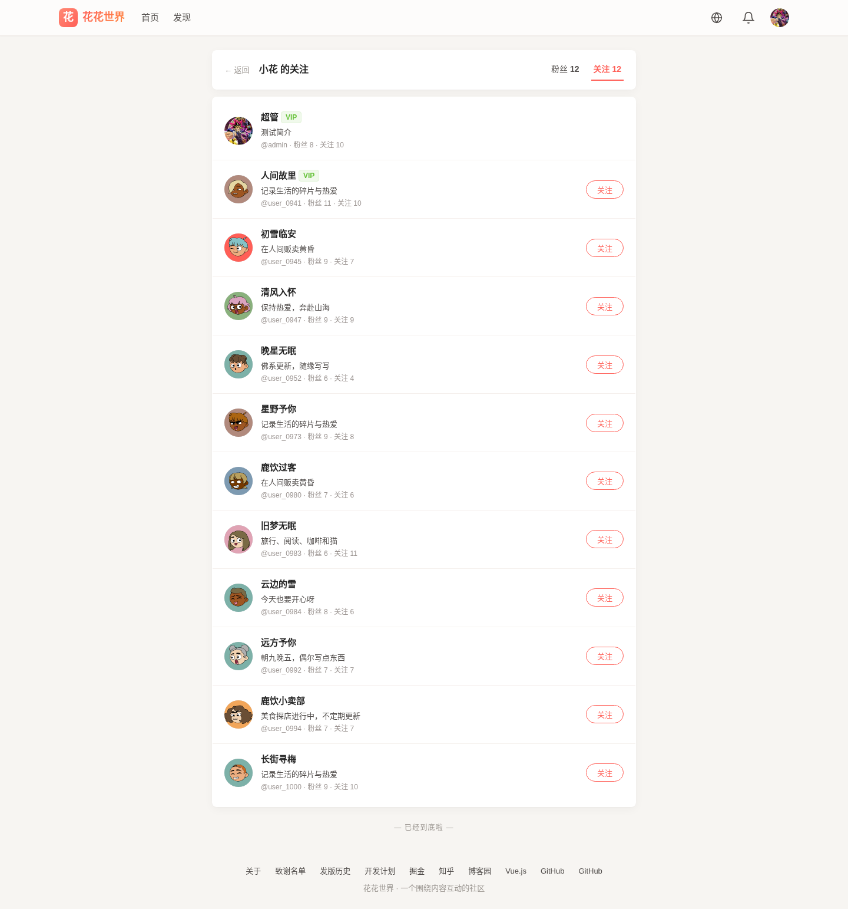
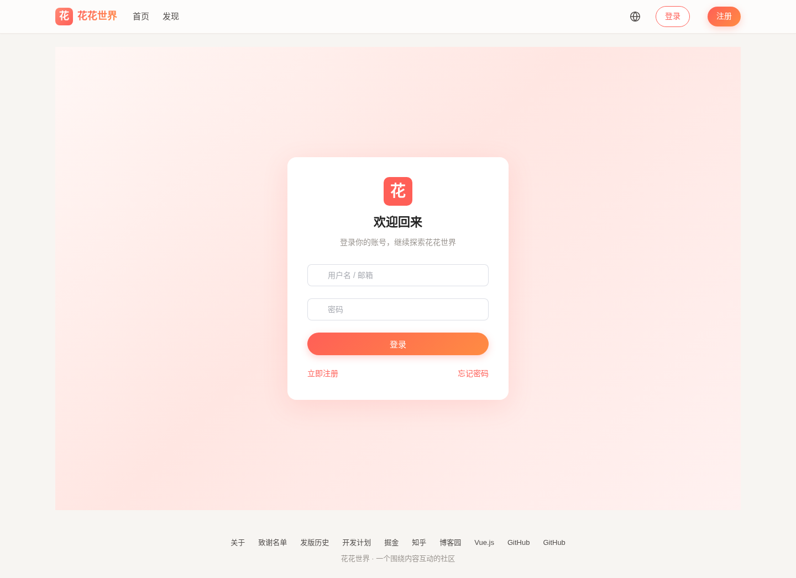
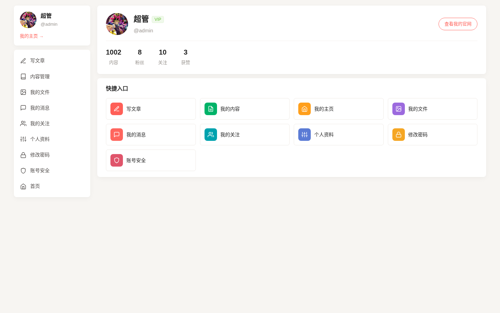
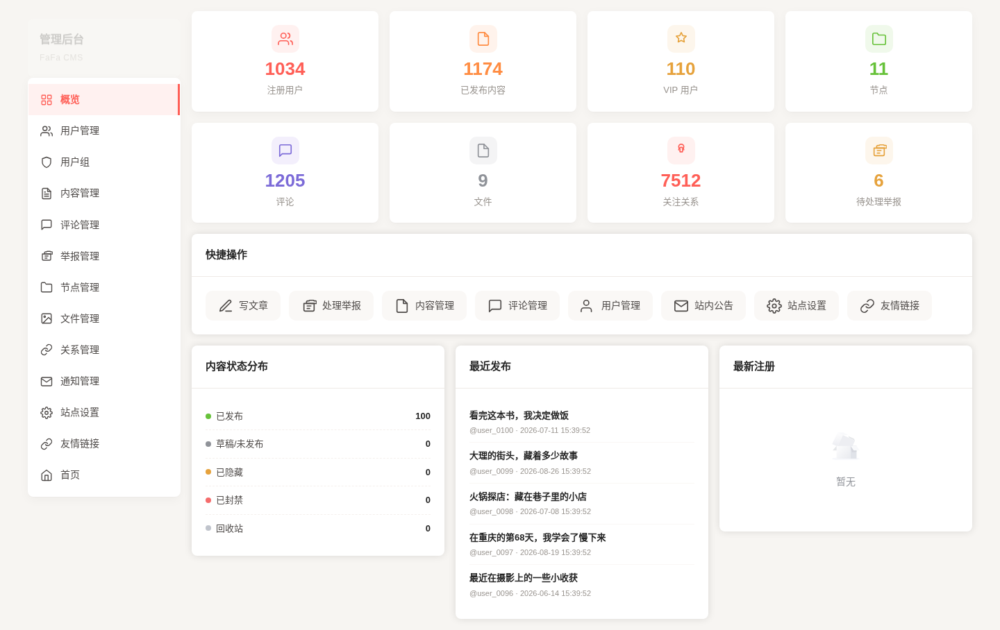
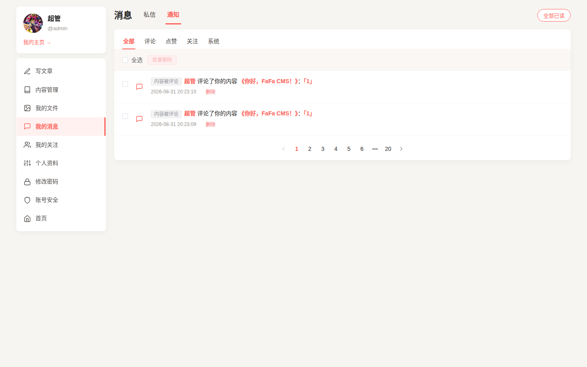

# FaFa CMS: 用 Golang 开发的分布式社交内容管理系统

> 🌐 [English](README_EN.md) · 简体中文

[](https://github.com/hunterhug/fafacms/network)
[](https://github.com/hunterhug/fafacms/stargazers)
[](https://github.com/hunterhug/fafacms)
[](https://goreportcard.com/report/github.com/hunterhug/fafacms)
[](https://github.com/hunterhug/fafacms/issues)

FaFa（花花）是一个用 `Golang` 开发的前后端分离内容社区系统（CMS），围绕内容进行互动、知己交流。终极目标：实现一个可用的内容社区产品。配套前端仓库：[hunterhug/fafafront](https://github.com/hunterhug/fafafront)（Vue 3）。

## 功能特性

1. 用户注册，填入相应信息如QQ，微博，邮箱，自我介绍，头像等，然后收到注册邮件，点击进行激活。未激活用户登陆后会显示未激活，无法使用平台。激活后用户可以登录后台，可以进行评论。用户注册后不提供注销功能。用户如果违禁被拉进黑名单不允许任何操作。用户发布内容和创建节点需要联系管理员赋予VIP权限。总结：未激活用户，普通用户，VIP用户，管理员，只有VIP用户可以创建内容，管理员可以操纵特殊权限路由。
2. 用户超级管理员高级权限控制，需要由管理员为用户分配用户组，用户组下有若干超级管理员路由资源，路由资源均为特殊路由，如更改其他用户密码，查看所有用户文章，用户信息，拉黑违禁用户等路由，如果用户不进入特殊资源路由，正常使用后台，即只能操作自己的资源，否则需要具备相应的组权限。该功能为普通用户无感知隐藏功能。
3. 用户信息一般操作，用户登录后台，进入后台后可以随时退出登录以及补充注册时的用户信息，修改密码等。用户忘记密码可以通过邮件找回。用户昵称一个月只能修改两次，且全局唯一。支持两步验证（2FA，标准 TOTP）绑定与登录，个人中心「账号安全」可查看/设置/关闭 2FA，管理员可帮助重置。
4. 内容编辑，VIP用户可以创建内容节点，节点下可以有子节点，但最多两层，节点间实现了拖曳排序的功能，智能无比，在节点下可以新建文章，可以更新内容，设置隐藏文章，文章置顶，设置文章密码等，文章设计了特殊的发布机制和历史版本功能，文章内容先保存在预发布字段，点击发布按钮才真正刷新进正式字段，每次更新内容时可以将草稿保存进历史，每次发布时，会相应保存进发布历史，可以从历史内容版本中恢复等。同时可以对文章进行拖曳排序。文章实现二次删除，被删除时会移到回收站，可以从回收站恢复或彻底删除（彻底删除仍是软删除 status=4，仅从用户世界消失、管理员后台仍可见，不物理删除、不级联删除评论/点赞/通知）。
5. 首页阅读和内容评论，所有用户可以浏览其他用户文章并进行评论，内容所有者可以设置关闭或者开启评论，评论相对智能仿QQ音乐，评论可以由评论所有者删除。其他用户也可以为内容或者内容的某条评论点赞或者取消点赞，详细记录登陆用户点赞等情况，防止多次点赞。其他用户可以举报文章和评论。服务端可以配置自动违禁，以及举报阈值，开启时当举报超过一定次数会自动将内容或评论违禁。评论有防刷验证码（高频触发）。管理员有举报列表，可查看举报并封禁/解除违禁。
6. 文件存储功能：用户头像，节点背景图，文章背景图等内部图片均需要通过上传接口保存进数据库，禁止使用不安全外部图片链接，图片存储在本地或者云对象存储服务中。文件有相应的列出，分类打标签等API功能。
7. 服务端可配置关闭用户注册，管理员权限的用户登录后台后，可以将用户加入黑名单，解除用户黑名单，激活用户，创建用户，将内容封禁，为用户赋予VIP等。
8. 互动消息站内信，如评论被点赞，内容被点赞，内容被评论，评论被评论。系统通知站内信，内容被违禁，评论被违禁，管理员通知广播（会扇出给所有用户）。站内信会通知相应用户。通知里的通知人/文章/评论可点击跳转；被删除的文章/评论显示占位符「文章被删除」「评论被删除」。
9. 关注用户，用户间可以互相关注，关注后，当某用户发布内容时，关注他的用户会收到站内信通知。
10. 私信，用户间私聊。（附加）
11. 用户和内容关键字搜索。（附加）
12. 安全体系：请求签名（HMAC，默认强制）、登录/注册/忘记密码/改密防爆破 + 图形验证码、反爬限流 + 验证码解封、密码 bcrypt 存储、两步验证 2FA、评论防刷验证码、安全响应头（CORS/XSS 等）；安全状态存 Redis，可多副本部署。邮箱验证码为 6 位数字短码，激活/改密错满 5 次自动作废并提示剩余次数。
15. 数据加密存储：数据库敏感字段（用户资料、私信、文章正文、评论、举报理由等）与本地存储的上传文件均加密落库落盘，防拖库 / 备份泄漏 / 磁盘失窃。密钥用信封加密——环境变量或部署脚本提供根密钥（KEK），派生每用户数据密钥（DEK）与每文件密钥（FEK）；加密绑定表名/列名/归属用户，密文被搬运即解密失败。需要等值查询的字段额外存盲索引（HMAC 摘要），因此**搜索只支持精确匹配、不支持模糊匹配**。根密钥缺失时回退内置默认值并在启动日志告警，便于本地开发零配置启动。
13. 站点配置与友情链接：管理后台可自定义**网站标题、网站副标题、关于社区介绍、页脚介绍**；友情链接可增删改查、排序、隐藏、新窗口打开；公开接口返回可见友情链接。
14. SEO 地址与节点隐藏：节点页 `/<用户>/node/<节点SEO>`、文章页 `/<用户>/node/<节点SEO>/<文章SEO>`；文章 SEO 在所属节点内唯一、节点 SEO 在账号内唯一，创建时默认随机生成（也可手动填写并查重），把文章移动到同名节点时自动加后缀；节点可隐藏（作者端节点树 / 管理后台），隐藏后该节点及其子节点下的文章退出公开列表、只有作者本人可见，直链仍可打开。
15. 移动端：前端全面适配移动端（响应式布局、移动端底部导航、私信/编辑器全屏等）。

## 产品展示

| 首页推荐 | 内容详情 | 个人主页 |
| --- | --- | --- |
|  |  |  |

| 发现 / 最新 | 粉丝 | 关注 |
| --- | --- | --- |
|  |  |  |

| 登录 | 个人中心 | 管理后台 |
| --- | --- | --- |
|  |  |  |

| 站内通知 | 私信聊天 |
| --- | --- |
|  |  |

## 技术栈

| 端 | 技术 |
| --- | --- |
| 后端 | Go 1.23 · Gin · XORM · MySQL · Redis · 阿里云 OSS · gomail（SMTP 邮件） |
| 前端 | Vue 3 · Vite · Element Plus（10 种界面语言） |
| 部署 | Docker / docker compose 一键（nginx 静态托管 + 反代），可多副本 |

## 目录结构

```
fafacms/
├── main.go              # 入口（配置/建表/路由装配）
├── core/
│   ├── config/          # 全局配置与版本
│   ├── controllers/     # 业务控制器（用户/内容/评论/消息/文件/举报…）
│   ├── model/           # 数据模型（xorm）
│   ├── router/          # 路由表（公开 + /v1 鉴权路由）
│   ├── server/          # gin 装配与中间件（签名/限流/安全头）
│   ├── session/         # Redis 会话
│   ├── util/            # 工具（oss/mail/rdb/captcha/totp…）
│   └── flog/            # 日志
├── docs/                # 接口文档（docsify）与截图
├── install/             # 一键部署（deploy.sh + docker-compose）
├── VERSION_LOG.md       # 发版历史
└── TODO_LIST.md         # 开发计划
```

## 快速开始（Docker 一键）

拥有一台类 Unix 机器，安装 `Docker` 与 `docker compose` 后：

```bash
git clone https://github.com/hunterhug/fafacms
cd fafacms/install
./deploy.sh            # up/ps/logs/down/rebuild
```

脚本会一键拉起 `mysql`、`redis`、`phpMyAdmin`、后端 API 与接口文档，并在控制台打印访问地址（含局域网 IP）：

| 服务 | 地址 |
| --- | --- |
| 后端 API | http://127.0.0.1:8080 |
| 接口文档 | http://127.0.0.1:9889 |
| phpMyAdmin | http://127.0.0.1:8000 |

数据持久化目录不在仓库内：macOS `~/.fafacms`，Linux `/opt/fafacms`，可用环境变量 `FAFACMS_DATA_DIR` 覆盖；配置见 `install/config.yaml`。

> 演示账号：管理员 `admin/admin`（首次启动自动创建，请及时修改）。示例密码仅供本地体验。

前端仓库的本地开发与联调方式见 [hunterhug/fafafront](https://github.com/hunterhug/fafafront) 的 README。

## 文档导航

- [发版历史](VERSION_LOG.md)：历次版本更新记录。
- [开发计划](TODO_LIST.md)：产品功能计划与进度（已实现 / 待实现）。
- [接口清单](docs/http/api.md)：接口文档清单。
- [部署指南](docs/deploy.md)：端到端部署（服务器 → 后端 → 前端 → HTTPS）。
- [部署说明](install/README.md)：后端详细部署与配置说明。

# License

本项目采用 [GNU Affero General Public License v3.0](https://www.gnu.org/licenses/agpl-3.0.html)（AGPL-3.0）许可。

你可以自由使用、修改和分发本项目，包括用于商业目的；但若你基于本项目向网络用户提供服务，AGPL-3.0 要求你向这些用户提供对应的完整源代码。完整条款见 [LICENSE](LICENSE)。

## 致谢

- [致谢名单](ACKNOWLEDGMENTS.md)：感谢每一位为本项目做出贡献的开发者。
